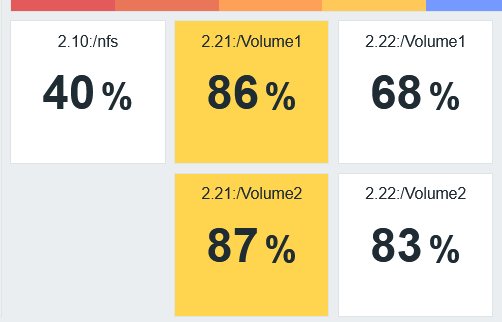
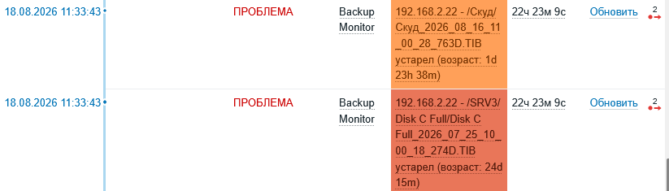

## What is it?
Данный репозиторий содержит исходный код утилиты для проверки наличия бекапов на различных хостах организации.

## How to?
При помощи `CreateConfig.dll` формируется файл `hosts.json`, который содержит различные данные для подключения на хосты.
Используя `CheckBackup.dll` и `DiskAvailableSpace` возможно проверить наличие бекапов и оставшееся свободное место для RAID накопителей.

## What's next?
`CheckBackup.dll` и `DiskAvailableSpace` возращают в консоль json объект, который может быть использован для
Zabbix Agent с последующим формирование discovery rule и триггеров.
Кроме этого, их можно использовать в качестве дополнения для иных утилит.

## Stack
- C# / .NET10. Основной язык
- FtpClient. Для проверки наличия бекапов.
- SshClient. Для сбора данных о накопителей RAID.

## Structure
- BackupChecker.sln
	- CreateConfig. Генерания hosts.json
	- CheckBackup. Проверка бекапов, используя пути из hosts.json
	- DiskAvailableSpace. Сбор данных о накопителях RAID, используя hosts.json.
	- HostLibrary. Библиотека, для проектов выше.

## Attachments

